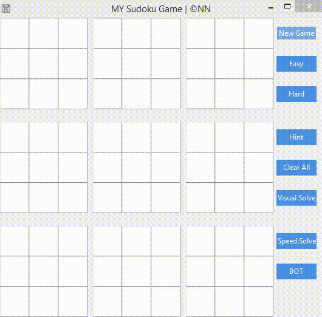
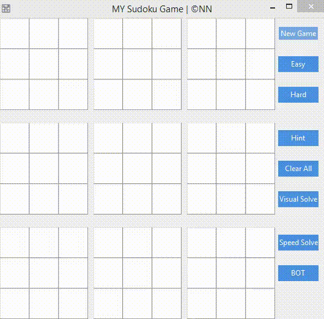
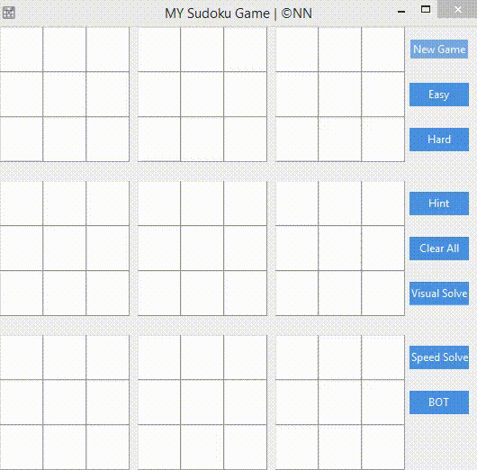

# Sudoku-Solver-GUI
This is a Sudoku Game it has many features like <b><u>Sudoku Solver</u></b> can able to solve any game by it self, 
It can <b><u>generates Sudoku puzzle</u></b> of two types <i>Easy</i> and <i>Hard</i>, The thing I really like is that it
solves with visualization of Backtracking Algorithm

   
<b>Module Used</b>
<pre><t>
from solver import *
import numpy as np
import random
import tkinter as tk
import time
import pyautogui
</t></pre>

<pre>
Python 3.9.0
</pre>

# Visual Solve

# Speed Solve

 
<pre>
<t>
©NN
</t>
</pre>
